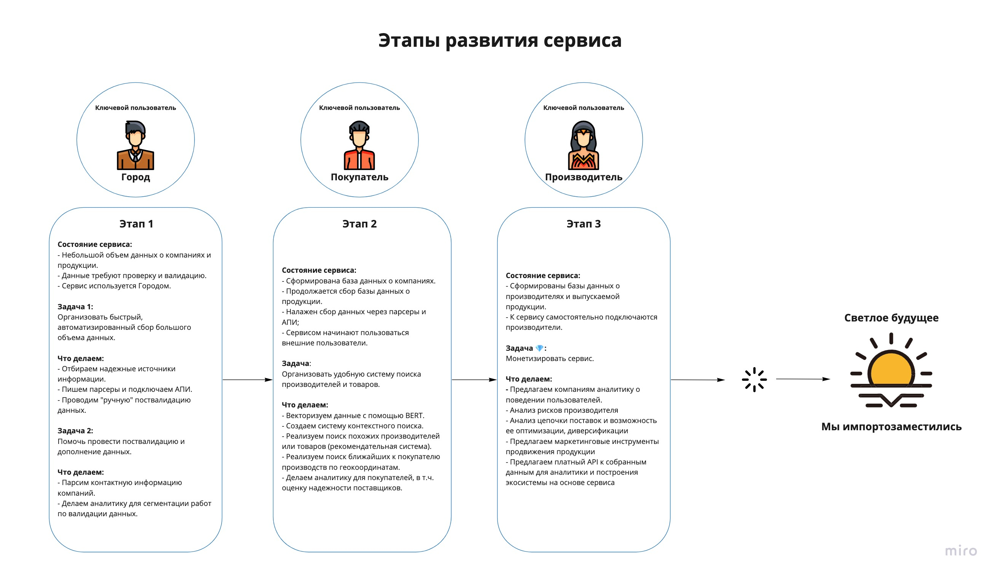
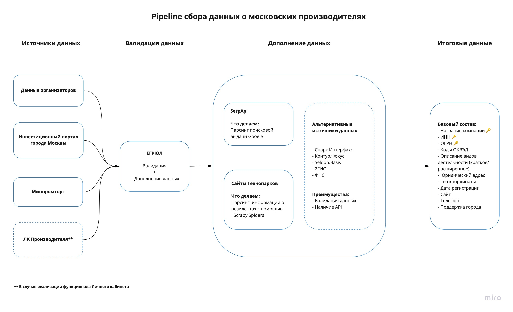
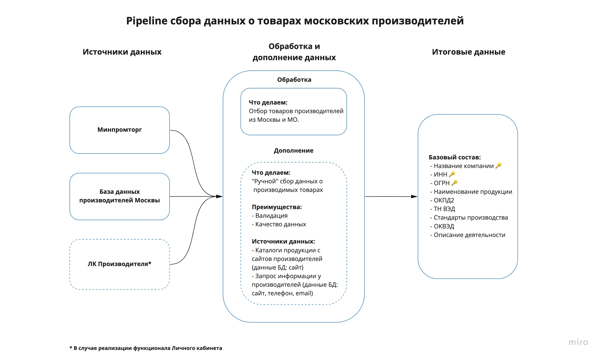

# Документация

# Постановка задач

- Разработать сервис по автоматическому сбору и систематизации данных о выпускаемой на территории Москвы продукции и о компаниях-производителях.
- Реализовать инструменты для анализа собранных данных.

# Проблемы и допущения

**Проблема: обширность поставленной задачи.** 

*У нас было 2 человека, 62 часа на решение, 10к на Яндекс.Облаке, бескрайние просторы интернета и бесконечное множество данных…*

**Допущение**: При решении задачи мы исходили из того, что процесс сбора данных должен быть разбит на части - точечно собирать данные гораздо удобнее, и на выходе мы получим информацию, которая потребует меньше затрат на проверку и подтверждение. Мы поставили себе ограничение по территориальному признаку (Москва и Московская области) и по видам деятельности компаний производителей (ОКВЭД 10-31).

**Проблема: масштабируемость решения.**

Допущение: Пусть мы поставили себе ограничение по территории и видам деятельности, однако при поиске данных мы старались выбирать те источники, которые могли бы быть использованы при дальнейшем масштабировании. Таким образом мы обеспечиваем однородность собираемых данных.

**Проблема: валидация данных.**

Допущение: Чтобы сократить затраты времени и сил на проверку данных для тех, кто будет в дальнейшем развивать сервис, мы старались использовать в качестве источников ресурсы только тех органов или компаний, которые самостоятельно занимаются проверкой своих данных.

**Проблема: парсинг.** 

Допущение: мы не верим в парсинг всех просторов интернета. Качественные данные требуют валидации, а потому мы исходим из того, что при разработке сервиса часть работы придется делать “вручную”.

# Подход к решению задачи

Поскольку сервис находится в начале своего развития, мы сосредоточились на 

- Поиске анологичных продуктов
- Разработке жизненного цикла продукта
- Сборе уже доступных отвалидированных данных из гос. источников

# Сбор данных о московских производителях

# Сбор данных о московской продукции

# Что сделано

**1) Организован процесс сбора данных о компаниях-производителях.**

- Первоначальный сбор данных о компаниях-производителях из открытых источников.
- Слепок базы ЕГРЮЛ ([https://egrul.itsoft.ru/csv/](https://egrul.itsoft.ru/csv/)): Отбор данных по региону и видам деятельности, их валидация по данным ЕГРЮЛ (проверяем, что все компании действующие, не были ликвидированы).
- Дополнение БД: парсинг контактной информации из технопарков и Google. Написано два Scrapy Spiders в качестве примера подхода к сбору данных с сайтов технопарков. Использован SerpAI API для парсинга поисковой выдачи гугл
- Формирование итоговой БД в PostgreSQL о компаниях-производителях Москвы.
- Векторазиция собранных даных с помощью DeepPavlov RuBert ([https://huggingface.co/DeepPavlov/rubert-base-cased-sentence](https://huggingface.co/DeepPavlov/rubert-base-cased-sentence))

**2) Организован процесс сбора данных о продукции, производимой на территории Москвы.**

- Первоначальный сбор данных о товарах, производимых в Москве.
- Отбор данных в соотстветсвии с БД московских производителей.
- Формирование итоговой БД  в PostgreSQL о компаниях-производителях Москвы.

**3) Предложены аналитические показатели для .**

**4) Векторизация данных.**

- С помощью DeepPavlov RuBert ([https://huggingface.co/DeepPavlov/rubert-base-cased-sentence](https://huggingface.co/DeepPavlov/rubert-base-cased-sentence)) превращаем всю доступную информацию о профелях компании в Embedding
- Записываем полученные Embeddings в https://github.com/meilisearch/meilisearch для дальнейшей работы с ними
- Можем делать Fuzzy Search по профилям компаний

**4) Предложен план дальнейшего развития сервиса.**

# Описание БД

**API к БД доступно по ссылке:** [http://51.250.101.92:8000/docs](http://51.250.101.92:8000/docs)

**БД CompaniesInfo**

🔑 **Ключи:**

inn: ИНН

ogrn: ОГРН

name: Краткое наименование компании (нижний регистр, без знаков препинания)

**Данные:**
full_name: Полное наименование
region: Код региона
okved_name: Описание вида деятельности
okved_0: Код класса ОКВЭД
okved_1: Код подкласса/группы ОКВЭД
okved_2: Код подгруппы/вида ОКВЭД
city: Город
street: Улица
house: Дом
corpus: Корпус/строение/здание/пр.
apartment: Офис/квартира
latitude: Широта
longitude: Долгота
website: Сайт
tel: Телефон
email: Адрес электронной почты
moscow_support: Есть ли поддержка от города
reg_date: Дата регистрации

**Аналитические показатели:**

num_products: Число товаров компании-производителя, доступных в БД московских продуктов. 

> Как использовать: фильтр для поиска производителей с наименьшим числом представленных в сервисе товаров.
> 

has_products: Наличие/отсутствие товаров производителя в БД московских продуктов. 

available_data_count: Степень наполненности 

missing_data: Ключевая информация, которую необходимо дополнить по компании.

similar_producers_num: Количество похожих по виду деятельности производителей. 

### **БД MoscowProducts**

🔑 **Ключи:**

short_name: краткое наименование компании (нижний регистр, без знаков препинания)
inn: ИНН

 **Остальные данные:**

full_name: полное наименование компании
ogrn: ОГРН
register_number: Реестровый номер продукции
product_name: Наименование продукции
okpd2: ОКПД2
tnved: ТН ВЭД
name_of_regulations: В соответствии с чем изготовлена продукция
okved_name: Описание вида деятельности 
okved_0: Код класса ОКВЭД

## Источники данных:

**ФНС**

- **База данных ЕГРЮЛ**

[https://egrul.nalog.ru/](https://egrul.nalog.ru/index.html)

Данные: Наименование компании, ИНН, коды ОКВЭД, описание видов деятельности, юридический адрес, email. 

Решает проблемы: масштабируемость, валидация. 

<aside>
💡 В нашем решении были использованы коды ОКВЭД только для основных видов деятельности. При последующем расширении базы данных возможно использование всех кодов ОКВЭД компаний.

</aside>

**Минпромторг**

- **Реестр производителей промышленной продукции, произведенной на территории Российской Федерации**

[https://gisp.gov.ru/opendata/11/](https://gisp.gov.ru/opendata/11/)

- **Реестр промышленной продукции, произведенной на территории Российской Федерации**

[https://gisp.gov.ru/opendata/12/](https://gisp.gov.ru/opendata/12/)

Дополнительные данные:

- **Производители лекарственных средств, производство которых осуществляется на территории Российской Федерации**

[https://minpromtorg.gov.ru/opendata/7705596339-manufacturersofmedicinesinRF/](https://minpromtorg.gov.ru/opendata/7705596339-manufacturersofmedicinesinRF/)

Данные: адреса фактических производств

Решает проблемы: масштабируемость, валидация.

**Правительство Москвы**

- **Инвестиционный портал Правительства Москвы**

[https://investmoscow.ru/about-moscow/investment-map?categories=5.0](https://investmoscow.ru/about-moscow/investment-map?categories=5.0)

 Решает проблемы: масштабируемость, валидация.

**Технопарки**

- **ОЭЗ Технополис Москва**

[https://technomoscow.ru/partners/](https://technomoscow.ru/partners/)

- **Сколково**

[https://navigator.sk.ru/](https://navigator.sk.ru/?q=N4IgZiBcoC4IYHMDOB9GBPADgUyiA9gE4gC%2BANCEngLQC22tARtoSkgJYB2AxrhZlACMJIA)

Решает проблемы: масштабируемость.

**Дополнительные источники данных:**

- Спарк Интерфакс
- Контур.Фокус
- Seldon.Basis
- 2ГИС

Решает проблемы: масштабируемость, валидация, парсинг (наличие API).

num_products: Число товаров компании-производителя, доступных в БД московских продуктов. 

has_products: Наличие/отсутствие товаров производителя в БД московских продуктов. 

available_data_count: Степень наполненности 

missing_data: Ключевая информация, которую необходимо дополнить по компании.

similar_producers_num: Количество похожих по виду деятельности производителей. 

“num_products” - число товаров компании-производителя